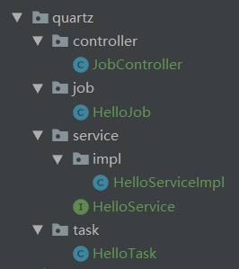
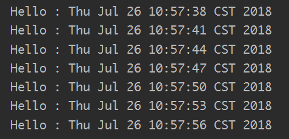

[](https://jitpack.io/#fengwenyi/JavaLib-quartz)


# JavaLib-quartz

Spring Boot Quartz

### 快速使用

1.添加依赖：

```xml
    <!-- 测试版需要指定仓库 -->
    <repositories>
        <repository>
            <id>jitpack.io</id>
            <url>https://jitpack.io</url>
        </repository>
    </repositories>
    
    <dependencies>
        <dependency>
            <groupId>com.github.fengwenyi</groupId>
            <artifactId>JavaLib-quartz</artifactId>
            <version>1.0-beta</version>
        </dependency>
    </dependencies>
```

2.task/HelloTask.java

```java
import com.fengwenyi.javalib.quartz.QuartzTask;
import org.springframework.stereotype.Component;

/**
 * @author Wenyi Feng
 */
@Component
public class HelloTask extends QuartzTask {
}
```
    
3.job/HelloJob.java

```java
import *.quartz.service.HelloService; // 原始包名被隐藏了
import org.quartz.JobExecutionContext;
import org.quartz.JobExecutionException;
import org.springframework.beans.factory.annotation.Autowired;
import org.springframework.scheduling.quartz.QuartzJobBean;

/**
 * @author Wenyi Feng
 */
public class HelloJob extends QuartzJobBean {

    @Autowired
    private HelloService helloService;

    @Override
    protected void executeInternal(JobExecutionContext context) throws JobExecutionException {
        helloService.sayHello();
    }
}
```

4.service/HelloService.java

```java
/**
 * @author Wenyi Feng
 */
public interface HelloService {

    void sayHello();

}
```

5.service/impl/HelloServiceImpl.java

```java
import com.fengwenyi.javalib.util.ToastUtil; // https://github.com/fengwenyi/JavaLib
import *.quartz.service.HelloService;
import org.springframework.stereotype.Service;

import java.util.Date;

/**
 * @author Wenyi Feng
 */
@Service
public class HelloServiceImpl implements HelloService {
    @Override
    public void sayHello() {
        ToastUtil.show("Hello : " + new Date());
    }
}
```

6.controller/JobController.java

```java
import com.fengwenyi.javalib.quartz.ScheduleBean;
import *.quartz.job.HelloJob;
import *.quartz.task.HelloTask;
import org.quartz.Scheduler;
import org.quartz.SchedulerException;
import org.springframework.beans.factory.annotation.Autowired;
import org.springframework.web.bind.annotation.RequestMapping;
import org.springframework.web.bind.annotation.RestController;

/**
 * @author Wenyi Feng
 */
@RestController
@RequestMapping("/job")
public class JobController {

    @Autowired
    private Scheduler scheduler;

    @Autowired
    private HelloTask task;

    @RequestMapping("/hello")
    public boolean hello() {
        ScheduleBean scheduleBean = new ScheduleBean();
        scheduleBean.setClazz(HelloJob.class);
        scheduleBean.setTime(3);
        scheduleBean.setJobName("JOB_NAME");
        scheduleBean.setJobGroup("GROUP_1");
        scheduleBean.setTriggerName("TRIGGER_NAME");
        scheduleBean.setTriggerGroup("GROUP_1");
        scheduleBean.setScheduler(scheduler);

        try {
            boolean rs = task.start(scheduleBean);
            return rs;
        } catch (SchedulerException e) {
            e.printStackTrace();
        }
        return false;
    }

}
```

7.目录结构



8.运行测试



### API

|名称|方法|参数|返回类型|说明|
|---|---|---|---|---|
|开启定时任务|start|(ScheduleBean, Map<String, Object>)|boolean|开启是否成功，true:成功，false:失败|
|开启定时任务|start|(ScheduleBean, Map<String, Object>)|boolean|开启是否成功，true:成功，false:失败|
|定时任务当前状态|status| - |boolean|定时任务当前状态，true:运行中，false:已停止|
|停止定时任务|stop| - |boolean|定时任务停止是否成功，true:成功，false:失败|

### ScheduleBean字段说明

|名称|参数|类型|说明|
|---|---|---|---|
|Scheduler|scheduler|Scheduler|Scheduler 对象|
|编号|id|Long| -，保留字段|
|名称|name|String|-，保留字段|
|描述|description|String|-，保留字段|
|选用类型|timeTime|TimeTypeEnum|选用构造Trigger对象类型|
|job类|clazz|Class|定时任务执行的job类|
|cron表达式|cron|String|cron表达式|
|时间间隔|time|Integer|每隔一段时间执行一次|
|时间间隔|atTime|Long|间隔一段时间后执行一次|
|Job名称|jobName|String|Job名称|
|Job组|jobGroup|String|Job组名称|
|TriggerName|triggerName|String|Trigger名称|
|Trigger组|triggerGroup|String|Trigger组名称|

### TimeTypeEnum

字段说明

|字段|类型|说明|
|---|---|---|
|code|Integer|代码|
|msg|String|说明|

值说明

|名称|代码|说明|
|---|---|---|
|SIMPLE|1|简单的定时任务，每隔一段时间执行一次|
|AT_TIME|2|间隔一段时间之后执行一次|
|CRON|3|使用cron表达式（时间点、循环、自定义时间）|

### 策略

1、优先选用指定方式构造Trigger

2、检查顺序：cron->atTime->simple，执行顺序：simple > atTime > cron 自下而上进行覆盖

### About Me

```
    ©author Wenyi Feng
```

### Licensed

```
   Copyright 2018 Wenyi Feng(xfsy_2015@163.com)

   Licensed under the Apache License, Version 2.0 (the "License");
   you may not use this file except in compliance with the License.
   You may obtain a copy of the License at

       http://www.apache.org/licenses/LICENSE-2.0

   Unless required by applicable law or agreed to in writing, software
   distributed under the License is distributed on an "AS IS" BASIS,
   WITHOUT WARRANTIES OR CONDITIONS OF ANY KIND, either express or implied.
   See the License for the specific language governing permissions and
   limitations under the License.